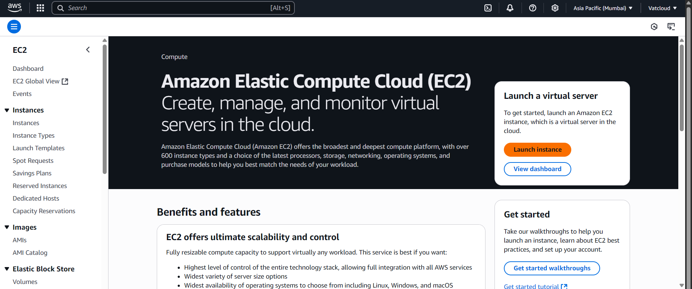
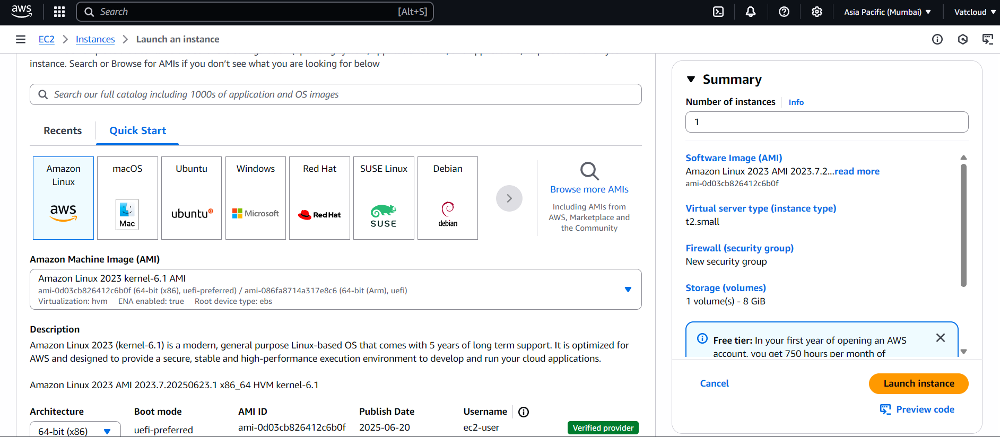
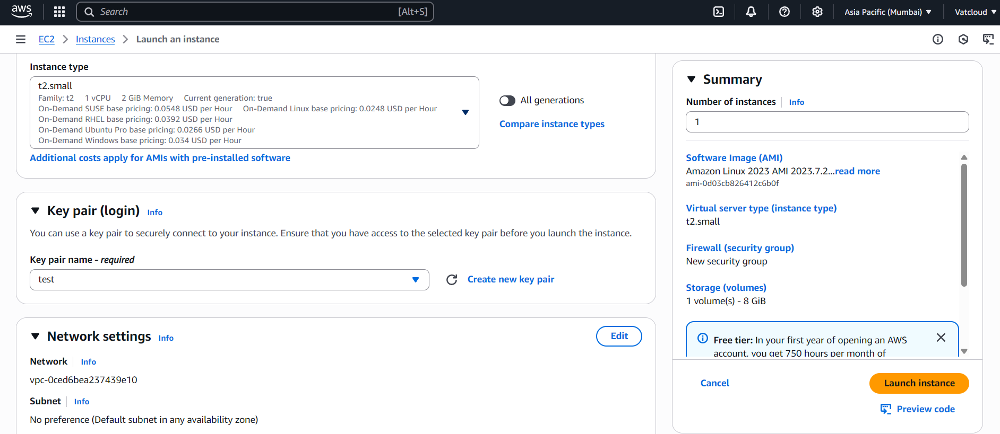
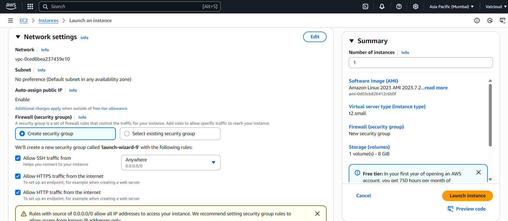
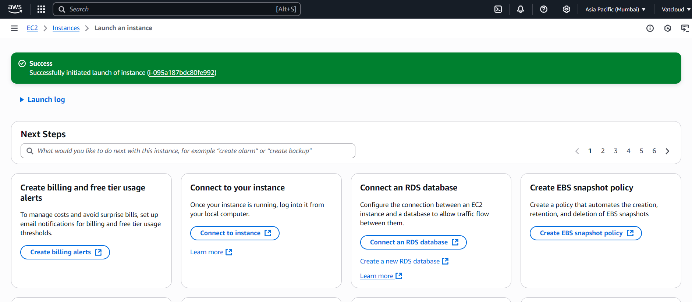
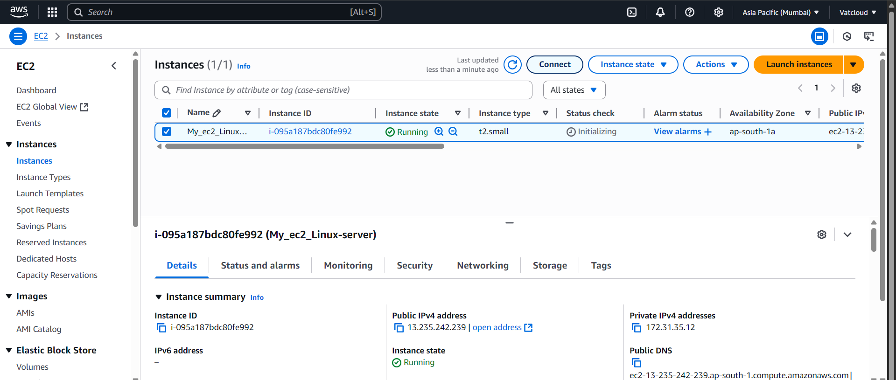
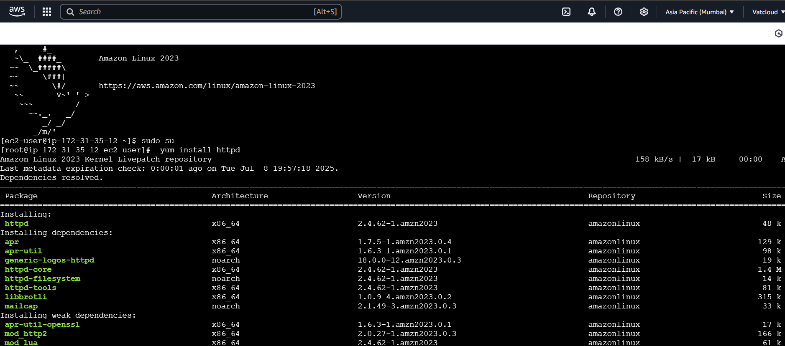
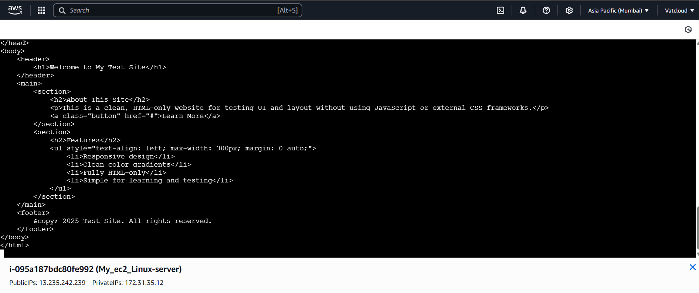
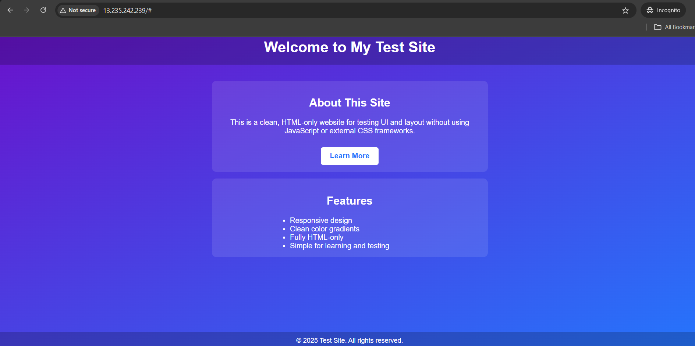

# 🚀 Launching a Linux Web Server on AWS EC2

This guide explains how to launch a Linux EC2 instance and host a basic website using Apache.

---

- ✨  **Step 1: Go to EC2 and Launch an Instance**  
  - Navigate to EC2 from AWS Console  
  - Click on “Launch Instance” to begin setup  

  

---

- 🧩  **Step 2: Select an OS**  
  - Choose Amazon Linux 2 AMI (Free tier eligible)  
  - This is the base operating system for your server  

  

---

- 🗝️  **Step 3: Choose Instance Type & Key Pair**  
  - Select t2.micro instance (Free tier)  
  - Create or choose an existing key pair for SSH access  

  

---

- 🌐  **Step 4: Configure Network Settings**  
  - Enable the following ports in the security group:  
    - SSH (22) – for remote access  
    - HTTP (80) – for website access  
    - HTTPS (443) – for secure access  

  

---

- ✅  **Step 5: Launch and Confirm Success**  
  - Review all settings and launch the instance  
  - Wait until the instance state shows "Running"  

  

---

- 🔌  **Step 6: Connect to the Instance**  
  - Use the “Connect” option in EC2 dashboard  
  - Follow SSH instructions based on key pair  

  

---

- 💻  **Step 7: Open Linux Terminal**  
  - After connection, the EC2 terminal will open  
  - You can now run Linux commands directly on the instance  

  

---

- ⚙️  **Step 8: Write Linux Commands**  
  - Update server and install Apache web server  
  - Start and enable Apache so it auto-starts  

  

---

- 📝  **Step 9: Add Your Website Code**  
  - Create a basic HTML file inside /var/www/html  
  - This file will act as your website homepage  

  

---

- 🌍  **Step 10: Visit Website Using Public IP**  
  - Copy the public IPv4 address of your instance  
  - Paste it into a browser to see your live site  

  

---

🎉  You’ve successfully launched a live Linux web server on AWS EC2!
